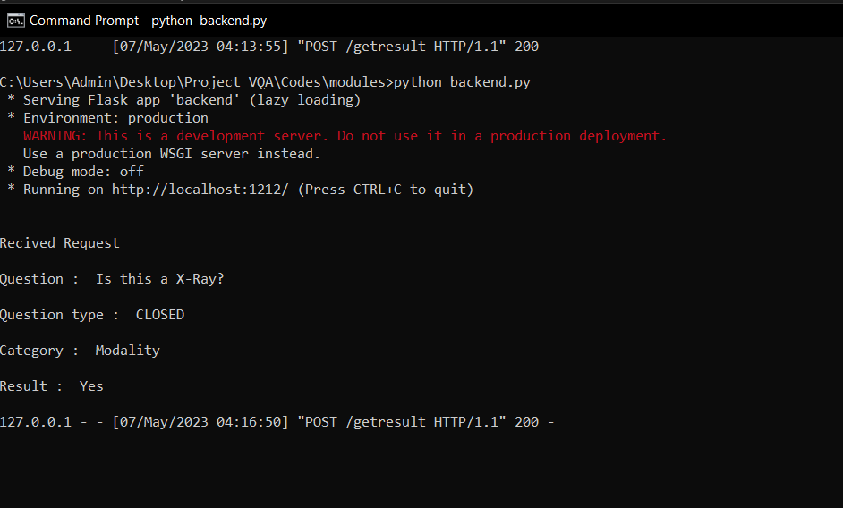
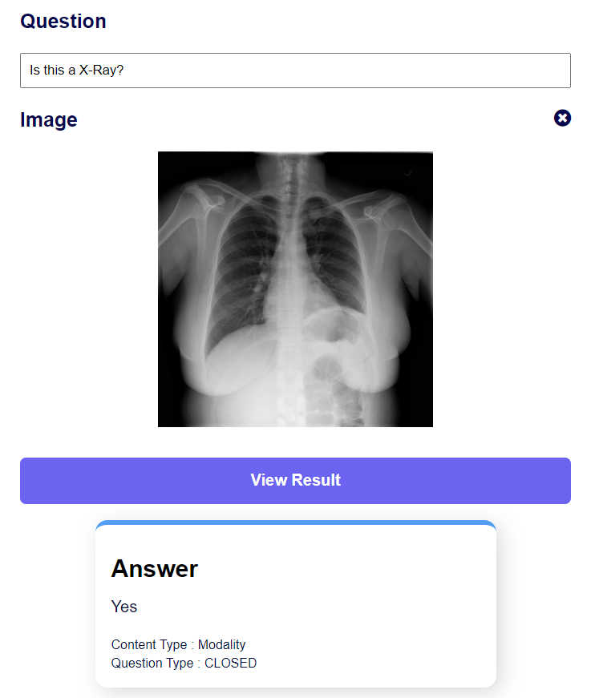
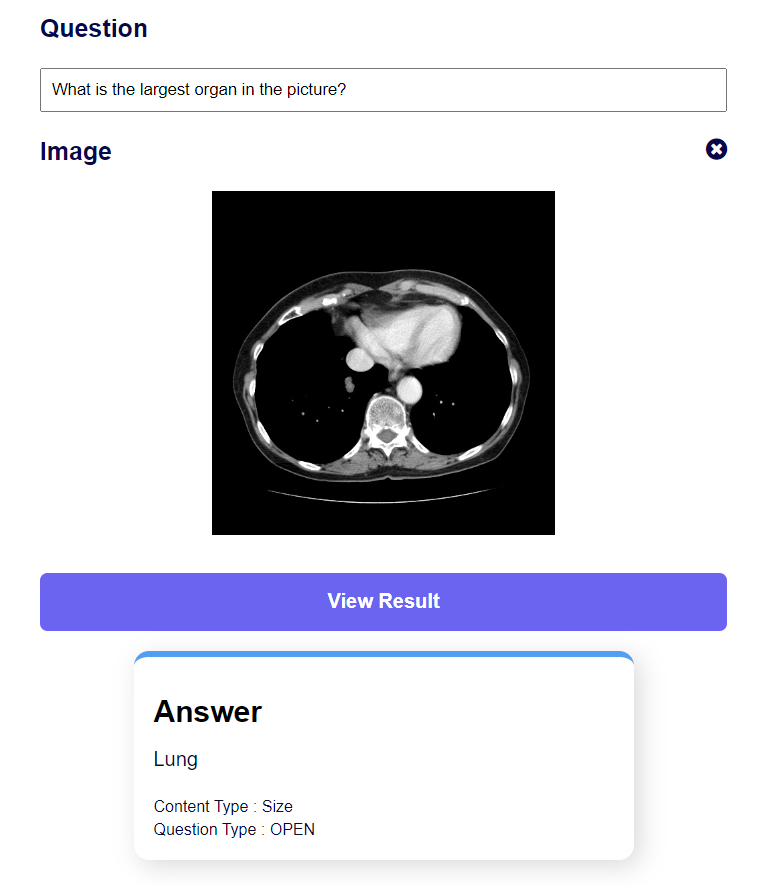

# Project_VQA

Topic : Medical Visual Question Answering

DataSet Used - Slave (A MVQA Dataset)

Question feature extraction using Glove

Image Feature exraction using CNN

Question classified with respec to Open/Closed and Content type
[Content type - "Modality","Position","Organ","Size","Abnormality","Quantity","Plane","Shape","Color"]

Both Feature fused and passed through dense layers to find answer.

## Setup

Clone Repo
Dataset should be downloaded manually[path Dataset/Slake].
Glove should be downloaded into Glove directory.

### To train model,run

    test_close.py
    test_open.py
    
### To check validity,run

    test_close_valid.py
    test_open_valid.py

### Some Screenshots

  
  
  

